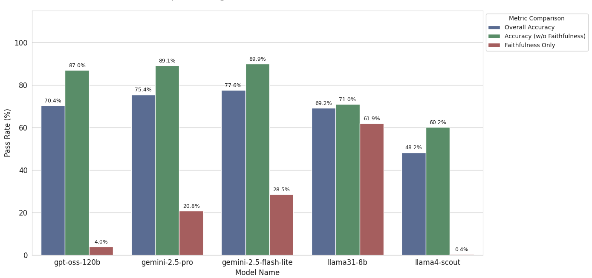
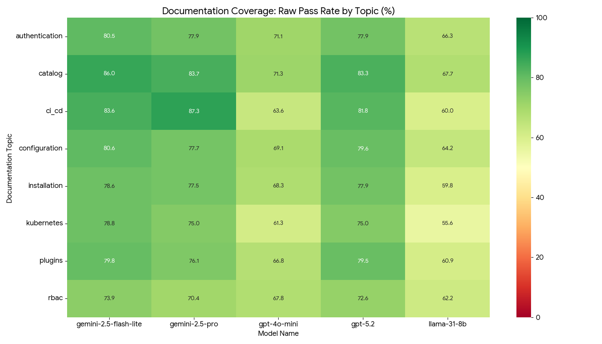
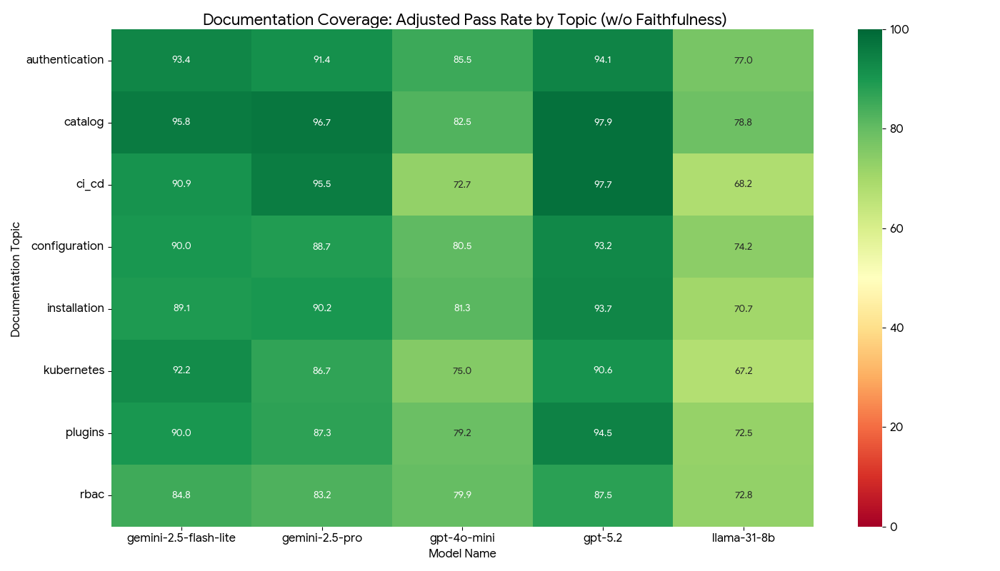

# Evaluation Results

This directory contains the detailed evaluation results.

It includes comparative visualizations at the root level, as well as individual subdirectories containing the raw data and detailed metrics for each specific model.

## 📊 High-Level Benchmarks

The following graphs provide a summary of performance across all evaluated models and topics.

| Visualization | Description |
| :--- | :--- |
| **** | **Model Pass Rate** Comparative performance of all models. |
| **** | **Topic Pass Rate** Breakdown of success rates across different documentation categories. |
| **** | **Topic Pass Rate (w/o Faithfulness)** Topic breakdown excluding the faithfulness metric for broader relevancy analysis. |

---

## 📂 Model Directories

Detailed logs, CSVs, and specific metric breakdowns can be found in the respective folder for each model:

* **[📁 gemini-2.5-flash-lite](./gemini-2.5-flash-lite)**
* **[📁 gemini-2.5-pro](./gemini-2.5-pro)**
* **[📁 gpt-4o-mini](./gpt-4o-mini)**
* **[📁 gpt-5.2](./gpt-5.2)**
* **[📁 llama-31-8b](./llama-31-8b)**

---

## 📏 Metrics Configured

For this evaluation, every Q&A pair was tested against 5 specific metrics at the **Turn Level**.

### 1. Ragas Metrics
*See official [Ragas documentation](https://docs.ragas.io/en/stable/concepts/metrics/available_metrics/).*

**Response Evaluation**
* **[`faithfulness`](https://docs.ragas.io/en/stable/concepts/metrics/available_metrics/faithfulness/)**

**Context Evaluation**
* **[`context_recall`](https://docs.ragas.io/en/stable/concepts/metrics/available_metrics/context_recall/)**
* **[`context_relevance`](https://docs.ragas.io/en/stable/concepts/metrics/available_metrics/nvidia_metrics/#context-relevance)**
* **[`context_precision_without_reference`](https://docs.ragas.io/en/stable/concepts/metrics/available_metrics/context_precision/#context-precision-without-reference)**

### 2. Custom Metrics
**Response Evaluation**
* **[`answer_correctness`](https://github.com/lightspeed-core/lightspeed-evaluation/blob/main/src/lightspeed_evaluation/core/metrics/custom/custom.py)**: A custom logic metric designed to validate the accuracy of the final response comparing with the expected_response.

---

## 📖 Reference: Understanding the Results

Each model directory above contains standard output files generated by the [`lightspeed-evaluation`](https://github.com/lightspeed-core/lightspeed-evaluation) tool. Use [this guide](https://github.com/lightspeed-core/lightspeed-evaluation/blob/main/docs/EVALUATION_GUIDE.md#10-understanding-results) to interpret the data.
